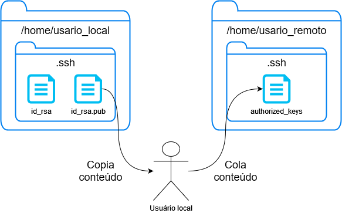

# DISCLAIMER: **NUNCA** COMPARTILHE SUA CHAVE PRIVADA (id_rsa)

# SSH

SSH é a sigla para Secure Shell, que é um protocolo de rede criptografado para comunicação segura entre dois dispositivos. Ele é amplamente utilizado para permitir o acesso remoto a servidores e outros dispositivos de rede de forma segura.

O SSH utiliza criptografia para proteger as informações transmitidas entre o cliente e o servidor. Ele permite que o usuário se conecte ao servidor remoto e execute comandos de forma segura, sem expor informações confidenciais, como senhas e dados privados.

Além disso, o SSH também fornece recursos de tunelamento, que permite que o usuário crie um túnel seguro para transferir dados de forma segura entre dois dispositivos, mesmo em uma rede não confiável.

O SSH é amplamente utilizado em ambientes empresariais e em infraestruturas de rede, pois oferece uma forma segura de gerenciar e acessar dispositivos de rede. Ele é suportado em diferentes sistemas operacionais, como Linux, macOS, Windows e outros sistemas Unix.

Em resumo, o SSH é um protocolo de rede seguro que fornece uma maneira segura de se comunicar e acessar dispositivos remotos.

## Chave Publica - Privada

A autenticação baseada em chave pública é um método de autenticação usado pelo SSH para verificar a identidade do usuário e do servidor remoto. Nesse método de autenticação, são usados pares de chaves criptográficas - uma chave pública e uma chave privada.

A chave pública é compartilhada livremente e pode ser armazenada em um arquivo conhecido como authorized_keys no servidor remoto. Já a chave privada é mantida em segredo pelo usuário e nunca é compartilhada.

Durante o processo de autenticação, o cliente SSH envia sua chave pública para o servidor remoto. Em seguida, o servidor verifica se a chave pública do cliente está presente no arquivo `authorized_keys`. Se estiver, o servidor criptografa um desafio usando a chave pública do cliente e envia de volta para o cliente.

O cliente SSH descriptografa o desafio usando sua chave privada e envia de volta para o servidor remoto. O servidor remoto, por sua vez, verifica se o desafio está correto e se a autenticação foi bem-sucedida. Se sim, o servidor permite que o usuário acesse o sistema.

Esse processo de autenticação é seguro porque é muito difícil para outra pessoa ou sistema criar uma chave privada que corresponda à chave pública de outra pessoa. Portanto, o uso de chaves pública e privada fornece um método seguro de autenticação para o SSH.

Além da autenticação baseada em chave pública, o SSH também suporta outros métodos de autenticação, como a autenticação baseada em senha e a autenticação baseada em token. No entanto, a autenticação baseada em chave pública é geralmente considerada mais segura, pois elimina a necessidade de compartilhar senhas ou outros dados confidenciais entre o usuário e o servidor.

## Autenticação, passo a passo:

1. O cliente envia a chave pública que ele possui (`id_rsa.pub` por exemplo)
2. O servidor verifica se existe aquela chave inserida no arquivo `authorized_keys` do usuário **remoto**
3. Se existir, ele envia um desafio para o cliente (uma string encriptada)
4. O cliente por sua vez vai desfazer a encriptação utilizando a sua chave privada (`id_rsa` por exemplo)
5. Se for bem sucessido, ele envia o resultado do desafio (hash MD5) pro servidor
6. O servidor verifica se o resultado do desafio está certo, se estiver, a conexão é estabelecida

## Esquema de arquivos

O esquema de arquivos deve ficar como na figura abaixo:

- O arquivo `id_rsa.pub` existe na máquina **local** do cliente, onde você vai usar para acessar o servidor, por exemplo o computador de sua casa
- O arquivo `authorized_keys` deve ficar dentro da pasta `/home/usuario_remoto/.ssh` no **servidor**
    - O conteúdo da `authorized_keys` deve conter chaves públicas (pode ter mais de uma, separada por linha) que você (ou outro usuário com acesso) preencham
    - Para preencher, precisa copiar o **conteúdo** da chave pública (`id_rsa.pub`) e colar dentro da `authorized_keys` (remota) 